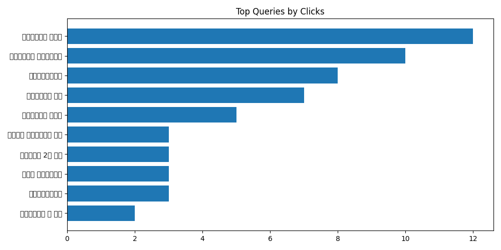

# Weekly SEO Report

## Executive Summary
Overall search clicks increased by 15.2% week over week. The top growing query was "ミュンヘン 2月 観光". The largest decline was observed for "カオサン通り 女 遊び". Direct was the strongest traffic channel this week.

- Current: **2025-12-08 → 2025-12-14**
- Previous: **2025-12-01 → 2025-12-07**
- Generated: 2025-12-17 06:00 UTC

## Google Search Console – Top Queries (WoW)
| query          |   clicks |   clicks_prev |   clicks_delta | clicks_pct   |   impressions |   position |
|:---------------|---------:|--------------:|---------------:|:-------------|--------------:|-----------:|
| カオサン通り 夜遊び     |       14 |            14 |              0 | 0.0%         |            69 |    2.92754 |
| カオサン通り ゴーゴーバー  |       11 |            12 |             -1 | -8.3%        |            19 |    1       |
| カオサン通り 風俗      |       11 |            12 |             -1 | -8.3%        |            19 |    1.15789 |
| 自衛隊から消防士       |        8 |             7 |              1 | 14.3%        |            33 |    2       |
| シドニー空港 お土産     |        6 |             6 |              0 | 0.0%         |            64 |    6.04688 |
| バンコク ゴーゴーバー 通り |        3 |             2 |              1 | 50.0%        |            35 |    5.54286 |
| カオサン通り 女 遊び    |        3 |             9 |             -6 | -66.7%       |            27 |    3.18519 |
| バリ島 キャッシング     |        3 |             2 |              1 | 50.0%        |            12 |    1.16667 |
| ミュンヘン 2月 観光    |        3 |           nan |              3 | —            |            11 |    1       |
| 自衛官から消防士       |        3 |             2 |              1 | 50.0%        |             8 |    2       |
| シドニー国際空港 お土産   |        2 |             2 |              0 | 0.0%         |            13 |    6.61538 |
| 淡水老街 グルメ       |        2 |           nan |              2 | —            |            13 |    7.53846 |
| カオサン通り 女       |        2 |             1 |              1 | 100.0%       |            11 |    5       |
| 警察官 自衛官 給料     |        2 |             2 |              0 | 0.0%         |             8 |    6.75    |
| 自衛官 うつ病 分限免職   |        2 |           nan |              2 | —            |             5 |    1       |
| カオサン ゴーゴーバー    |        2 |             1 |              1 | 100.0%       |             3 |    1       |
| カオサン 風俗        |        2 |             1 |              1 | 100.0%       |             3 |    1.33333 |
| カオサン通り エロ      |        2 |             2 |              0 | 0.0%         |             3 |    2       |
| カオサン通り 女遊び     |        2 |             3 |             -1 | -33.3%       |             2 |    2       |
| 47都道府県 制覇      |        1 |           nan |              1 | —            |            28 |   10.5714  |

## Google Analytics (GA4) – Sessions by Channel (WoW)
| channel_group   |   sessions |   sessions_prev |   sessions_delta | sessions_pct   |
|:----------------|-----------:|----------------:|-----------------:|:---------------|
| Organic Search  |        382 |             459 |              -77 | -16.8%         |
| Direct          |         79 |              76 |                3 | 3.9%           |
| Referral        |         16 |              13 |                3 | 23.1%          |
| Unassigned      |         10 |              10 |                0 | 0.0%           |
| Organic Social  |          5 |              16 |              -11 | -68.8%         |

## Visuals

