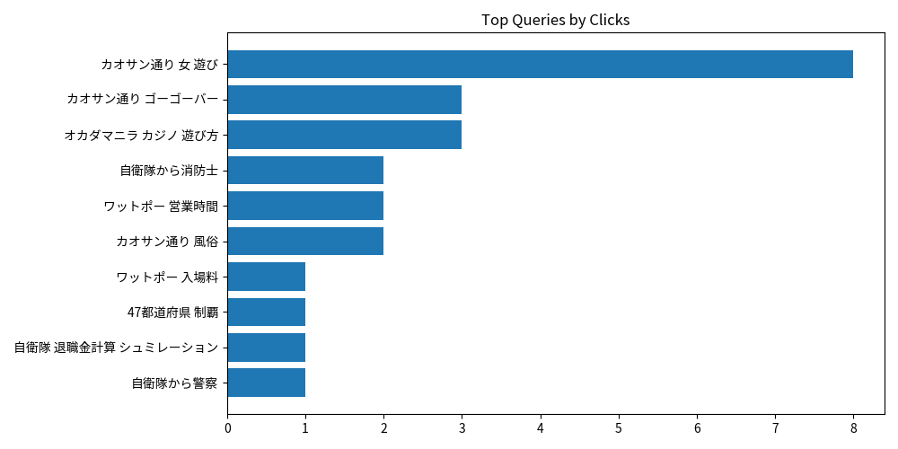

# Weekly SEO Report

## Executive Summary

Search clicks changed by -20.8% WoW (42 vs 53). Impressions changed by -18.1% WoW (868 vs 1,060). CTR is 4.8% (-0.2pt WoW). Avg position is 24.70 (-1.73 WoW). Top gaining query: "自衛隊から消防士" (+2 clicks). Top losing query: "カオサン通り 夜遊び" (-5 clicks). GA4 sessions changed by 17.4% WoW (398 vs 339). Top traffic channel: Organic Search.

- Current: **2026-07-13 → 2026-07-19**
- Previous: **2026-07-06 → 2026-07-12**
- Generated: 2026-07-19 22:02 UTC

## Google Search Console – Top Queries (WoW)
| query              |   clicks |   clicks_prev |   clicks_delta | clicks_pct   |   impressions | ctr   |   position |
|:-------------------|---------:|--------------:|---------------:|:-------------|--------------:|:------|-----------:|
| カオサン通り 女 遊び        |        8 |            11 |             -3 | -27.3%       |            35 | 22.9% |       3.11 |
| カオサン通り ゴーゴーバー      |        3 |             5 |             -2 | -40.0%       |            12 | 25.0% |       1.58 |
| オカダマニラ カジノ 遊び方     |        3 |             7 |             -4 | -57.1%       |             7 | 42.9% |       3.29 |
| 自衛隊から消防士           |        2 |             0 |              2 | —            |            16 | 12.5% |       3.31 |
| ワットポー 営業時間         |        2 |             1 |              1 | 100.0%       |            14 | 14.3% |       7.36 |
| カオサン通り 風俗          |        2 |             4 |             -2 | -50.0%       |            10 | 20.0% |       2.3  |
| ワットポー 入場料          |        1 |             1 |              0 | 0.0%         |            72 | 1.4%  |       8.97 |
| 47都道府県 制覇          |        1 |             3 |             -2 | -66.7%       |            38 | 2.6%  |       9.45 |
| 自衛隊 退職金計算 シュミレーション |        1 |             0 |              1 | —            |            38 | 2.6%  |       8.47 |
| 自衛隊から警察            |        1 |             0 |              1 | —            |            19 | 5.3%  |       4.95 |
| カオサン通り 夜遊び         |        1 |             6 |             -5 | -83.3%       |            10 | 10.0% |       4.2  |
| 警察と自衛隊どっちがいい       |        1 |             0 |              1 | —            |            10 | 10.0% |       5    |
| 消防士 転職             |        1 |             0 |              1 | —            |             9 | 11.1% |      38.67 |
| デンパサール空港 atm       |        1 |             1 |              0 | 0.0%         |             6 | 16.7% |       2.5  |
| 自衛隊から市役所 転職        |        1 |             1 |              0 | 0.0%         |             4 | 25.0% |       3.75 |
| インドネシア atm 手数料     |        1 |             0 |              1 | —            |             3 | 33.3% |       5.67 |
| バンコク ゴーゴーバー        |        1 |             0 |              1 | —            |             3 | 33.3% |      23.67 |
| ボンダイビーチ カフェ        |        1 |             0 |              1 | —            |             3 | 33.3% |       7.33 |
| 自衛官 転職 40代         |        1 |             0 |              1 | —            |             3 | 33.3% |       5.33 |
| 自衛隊 再任用 難しい        |        1 |             0 |              1 | —            |             3 | 33.3% |      34    |

## Google Analytics (GA4) – Sessions by Channel (WoW)
| channel_group   |   sessions |   sessions_prev |   sessions_delta | sessions_pct   |   total_users |
|:----------------|-----------:|----------------:|-----------------:|:---------------|--------------:|
| Organic Search  |        271 |             229 |               42 | 18.3%          |           240 |
| Direct          |         87 |              99 |              -12 | -12.1%         |            82 |
| Organic Social  |         26 |               2 |               24 | 1200.0%        |            21 |
| Referral        |         10 |               5 |                5 | 100.0%         |             7 |
| AI Assistant    |          3 |               2 |                1 | 50.0%          |             3 |
| Unassigned      |          1 |               2 |               -1 | -50.0%         |             1 |

## Visuals

## Notes / Next Actions
- Investigate the largest click drops (Queries → Pages) and check indexability/canonical/internal-link changes.
- New queries appeared WoW—map them to landing pages and expand content clusters to capture more long-tail demand.
- Organic Search sessions grew WoW—double down on winning pages (refresh content + add internal links).
