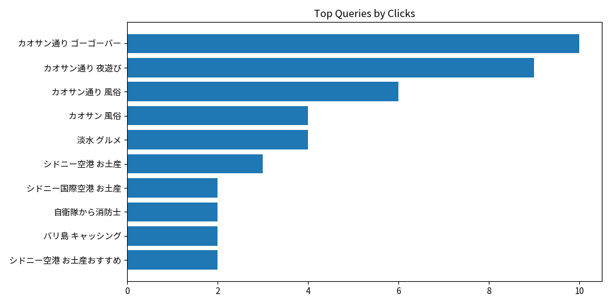

# Weekly SEO Report

## Executive Summary

Search clicks changed by -26.7% WoW (66 vs 90). Impressions changed by -28.0% WoW (852 vs 1,183). CTR is 7.7% (+0.1pt WoW). Avg position is 16.79 (-4.00 WoW). Top gaining query: "淡水 グルメ" (+4 clicks). Top losing query: "カオサン通り 夜遊び" (-7 clicks). GA4 sessions changed by -28.1% WoW (384 vs 534). Top traffic channel: Organic Search.

- Current: **2026-09-21 → 2026-09-27**
- Previous: **2026-09-14 → 2026-09-20**
- Generated: 2026-09-27 23:46 UTC

## Google Search Console – Top Queries (WoW)
| query             |   clicks |   clicks_prev |   clicks_delta | clicks_pct   |   impressions | ctr    |   position |
|:------------------|---------:|--------------:|---------------:|:-------------|--------------:|:-------|-----------:|
| カオサン通り ゴーゴーバー     |       10 |             8 |              2 | 25.0%        |            27 | 37.0%  |       1.7  |
| カオサン通り 夜遊び        |        9 |            16 |             -7 | -43.8%       |            62 | 14.5%  |       5.06 |
| カオサン通り 風俗         |        6 |            11 |             -5 | -45.5%       |            14 | 42.9%  |       2.14 |
| カオサン 風俗           |        4 |             3 |              1 | 33.3%        |            13 | 30.8%  |       2.31 |
| 淡水 グルメ            |        4 |             0 |              4 | —            |             7 | 57.1%  |       8.29 |
| シドニー空港 お土産        |        3 |             3 |              0 | 0.0%         |            50 | 6.0%   |       7.28 |
| シドニー国際空港 お土産      |        2 |             1 |              1 | 100.0%       |            18 | 11.1%  |       5    |
| 自衛隊から消防士          |        2 |             0 |              2 | —            |            18 | 11.1%  |       3.28 |
| バリ島 キャッシング        |        2 |             1 |              1 | 100.0%       |             4 | 50.0%  |       1.5  |
| シドニー空港 お土産おすすめ    |        2 |             1 |              1 | 100.0%       |             3 | 66.7%  |       7    |
| バリ島 空港 atm        |        2 |             3 |             -1 | -33.3%       |             2 | 100.0% |       1.5  |
| 自衛官 定年後 仕事 ない     |        2 |             0 |              2 | —            |             2 | 100.0% |      31.5  |
| 自衛隊 再任用 難しい       |        1 |             0 |              1 | —            |            19 | 5.3%   |       9.84 |
| シドニー空港 お土産 売り場    |        1 |             0 |              1 | —            |            13 | 7.7%   |       7.31 |
| バンコク ゴーゴーバー通り     |        1 |             0 |              1 | —            |            12 | 8.3%   |       7.42 |
| ゴーゴーバー おすすめ       |        1 |             0 |              1 | —            |             8 | 12.5%  |      10.25 |
| シドニー空港 ターミナル1 お土産 |        1 |             1 |              0 | 0.0%         |             7 | 14.3%  |       7.29 |
| オカダマニラ 遊び方        |        1 |             2 |             -1 | -50.0%       |             6 | 16.7%  |       2.67 |
| インドネシア atm キャッシング |        1 |             0 |              1 | —            |             5 | 20.0%  |       5.8  |
| デンパサール空港 atm      |        1 |             2 |             -1 | -50.0%       |             5 | 20.0%  |       2.4  |

## Google Analytics (GA4) – Sessions by Channel (WoW)
| channel_group   |   sessions |   sessions_prev |   sessions_delta | sessions_pct   |   total_users |
|:----------------|-----------:|----------------:|-----------------:|:---------------|--------------:|
| Organic Search  |        296 |             321 |              -25 | -7.8%          |           261 |
| Direct          |         75 |             207 |             -132 | -63.8%         |            72 |
| Referral        |          7 |               1 |                6 | 600.0%         |             7 |
| AI Assistant    |          3 |               0 |                3 | —              |             1 |
| Unassigned      |          2 |               3 |               -1 | -33.3%         |             2 |
| Organic Social  |          1 |               2 |               -1 | -50.0%         |             1 |

## Visuals

## Notes / Next Actions
- Investigate the largest click drops (Queries → Pages) and check indexability/canonical/internal-link changes.
- New queries appeared WoW—map them to landing pages and expand content clusters to capture more long-tail demand.
